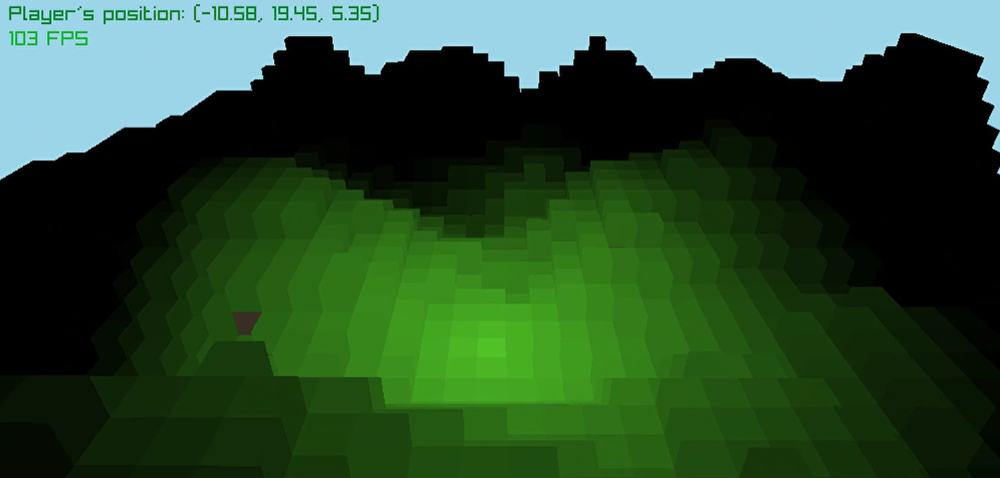
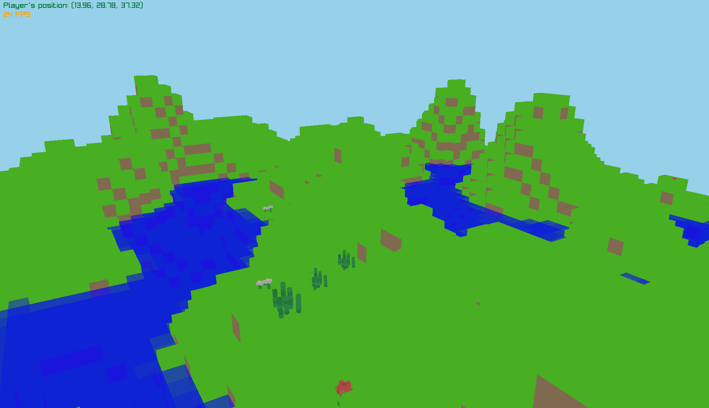

# PtotahovatsiStroj
A voxel engine built using **raylib-go** and **OpenGL**

##  Features 🌟
- **Infinite Random World Generation**: Utilizes a Perlin noise algorithm for creating expansive landscapes.
- **Dynamic Lighting**: Implemented basic lighting to enhance the visual experience.

## Upcoming Features 📋
- **Layered Landscapes**: Add more geological layers, such as stone.
- **Enhanced Lighting**: Introduce ambient occlusion for better depth perception.
- **Fog Effects**: Create atmospheric depth with fog.
- **Water Formations**: Integrate realistic water bodies into the world generation.
- **Surface Feature System**: Add trees, flowers, and grass to enrich the environment.
- **Block Interaction**: Enable players to place and destroy blocks.
- **Biome Diversity**: Implement various biomes for a richer exploration experience.
- **Cave Generation**: Create intricate cave systems for players to discover.
- **Web Build**: Compile the project to WASM.

## Screenshots 🖼️

## Getting Started 🚀
To get started with the voxel engine, clone the repository and open the folder. Make sure you have Go installed on your device. Then, run the command `go mod tidy` and finally, to compile the project, run `go run ./src`.

## License 📄
This project is licensed under the MIT License - see the `LICENSE` file for details.

## Acknowledgments 🙏
Inspired by CubeWorld and [TanTan's](https://github.com/TanTanDev) Voxel engine built with the beavy engine. <!--Special thanks to the resources and tutorials that helped shape this project.-->