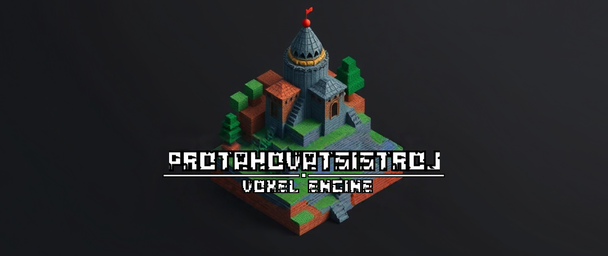
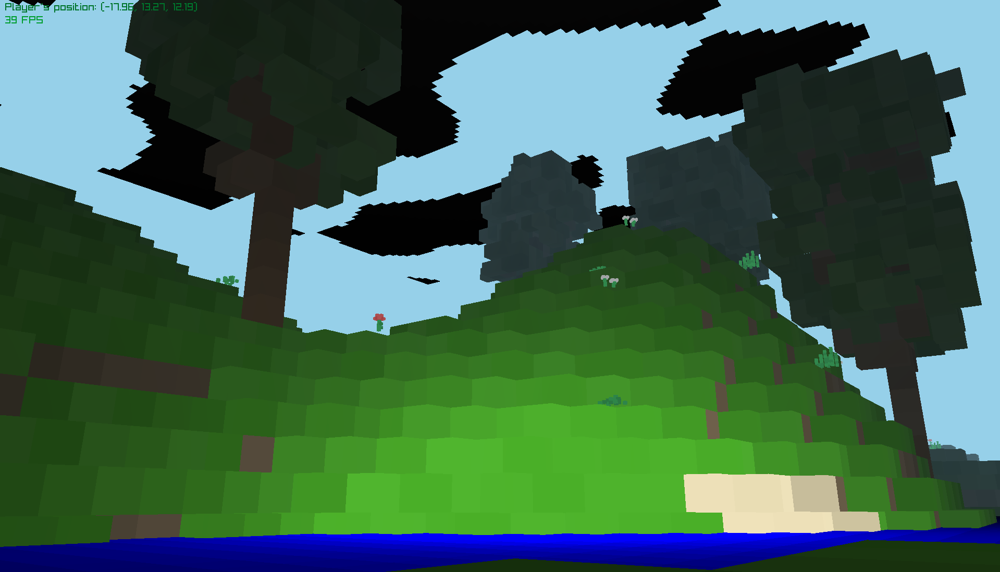
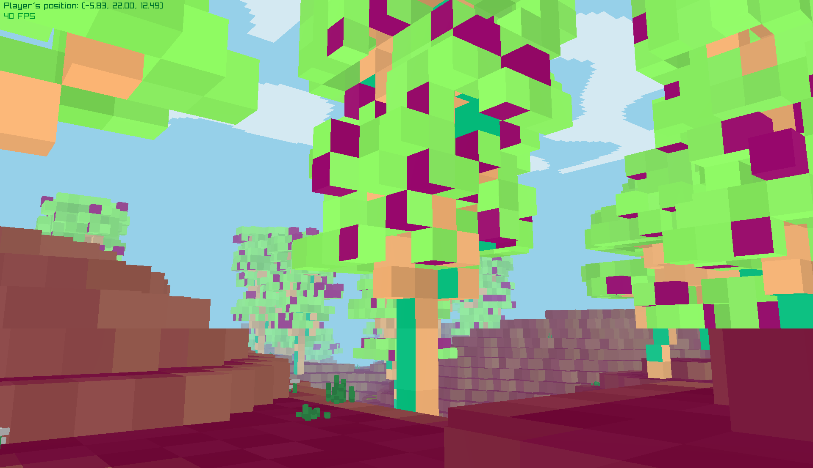
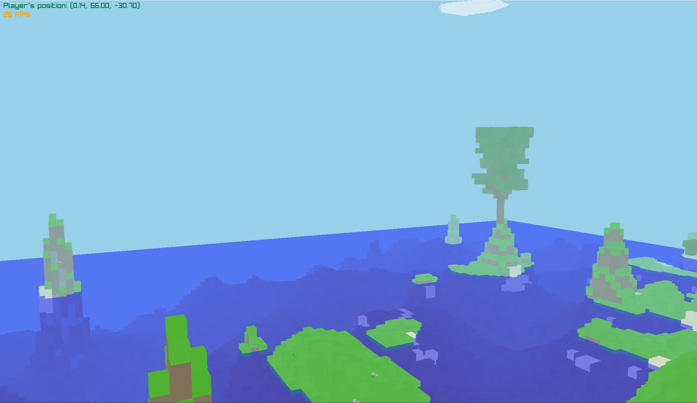

# PtotahovatsiStroj
### v0.12.2

A voxel engine built using **raylib-go** and **OpenGL**

##  Features 🌟
- **Infinite Random World Generation**: Utilizes a Perlin noise algorithm for creating expansive landscapes.
- **Water Formations**: Realistic water bodies.
- **Surface Feature System**: Procedurally generated trees with [L-systems](https://en.wikipedia.org/wiki/L-system) and randomly placed flowers and tall grass.
- **Cave Generation**: Intricate cave systems made using 3D perlin noise.
- **Basic Shading**: Combines ambient with directional lighting for better depth perception.
- **Atmospheric effects**: Atmospheric depth with fog and basic clouds.
- **Cache System**: Efficiently stored surface features positions, providing better world consistency.

## Upcoming Features 📋
- **Smooth Lighting**: Improved lighting using vertex lighting and baked ambient occlusion.
- **Block Interaction**: Enable players to place and destroy blocks.
- **Biome Diversity**: Implement various biomes depending on the terrain.
- **Dynamic Weather & Time Cycle**: Add a day/night cycle and weather effects such as rain and snow.
- **Game Settings**: Add a configuration menu accessible via a dedicated key where players can configure the view distance, FPS limits, world rules (weather, day/night cycle and add/remove or change cloud height), and toggle debug such as like FPS and player position.
- **Web Build**: Compile the project to WASM.

## Screenshots 🖼️

## Getting Started 🚀
To get started with the voxel engine, clone the repository and open the folder. Make sure you have Go installed on your device. Then, run the command `go mod tidy` and finally, to compile the project, run `go run ./src`.

## Controls 🎮
- **Mouse Left Button**: Lock cursor.
- **Camera**: WASD movement, mouse to look.
- **Esc**: To close the window.

## License 📄
This project is licensed under the MIT License - see the `LICENSE` file for details.

## Acknowledgments 🙏
Inspired by [CubeWorld](https://store.steampowered.com/app/1128000/Cube_World/) and [TanTan's](https://github.com/TanTanDev) Voxel engine built with the beavy engine. I would also like to acknowledge the use of voxelized vegetation assets from [MangoVoxel](https://mangovoxel.itch.io/voxelfoliage) in my voxel engine. The shader code was based on examples provided by [raylib](https://www.raylib.com/).<!--Special thanks to the resources and tutorials that helped shape this project.-->