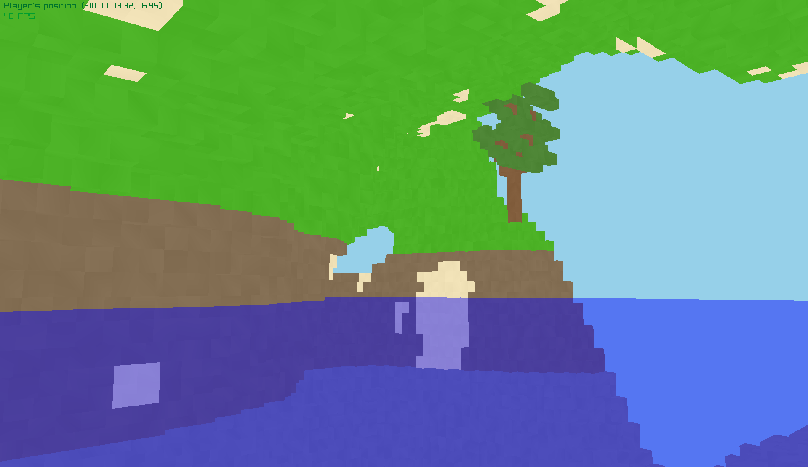

# PtotahovatsiStroj
### v0.9.8

A voxel engine built using **raylib-go** and **OpenGL**

##  Features 🌟
- **Infinite Random World Generation**: Utilizes a Perlin noise algorithm for creating expansive landscapes.
- **Water Formations**: Realistic water bodies.
- **Surface Feature System**: Precedurally generated trees with [L-systems](https://en.wikipedia.org/wiki/L-system) and randomly placed flowers and tall grass.
- **Cave Generation**: Intricate cave systems made using 3D perlin noise.
- **Cache System**: Efficiently stored surface features positions, providing better world consistency.

## Upcoming Features 📋
- **Dynamic Lighting**: Implemented basic lighting with shading and ambient occlusion for better depth perception.
- **Fog Effects**: Create atmospheric depth with fog.
- **Block Interaction**: Enable players to place and destroy blocks.
- **Biome Diversity**: Implement various biomes for a richer exploration experience.
- **Web Build**: Compile the project to WASM.

## Screenshots 🖼️

## Getting Started 🚀
To get started with the voxel engine, clone the repository and open the folder. Make sure you have Go installed on your device. Then, run the command `go mod tidy` and finally, to compile the project, run `go run ./src`.

## License 📄
This project is licensed under the MIT License - see the `LICENSE` file for details.

## Acknowledgments 🙏
Inspired by [CubeWorld](https://store.steampowered.com/app/1128000/Cube_World/) and [TanTan's](https://github.com/TanTanDev) Voxel engine built with the beavy engine. I would also like to acknowledge the use of voxelized vegetation assets from [MangoVoxel](https://mangovoxel.itch.io/voxelfoliage) in my voxel engine. <!--Special thanks to the resources and tutorials that helped shape this project.-->